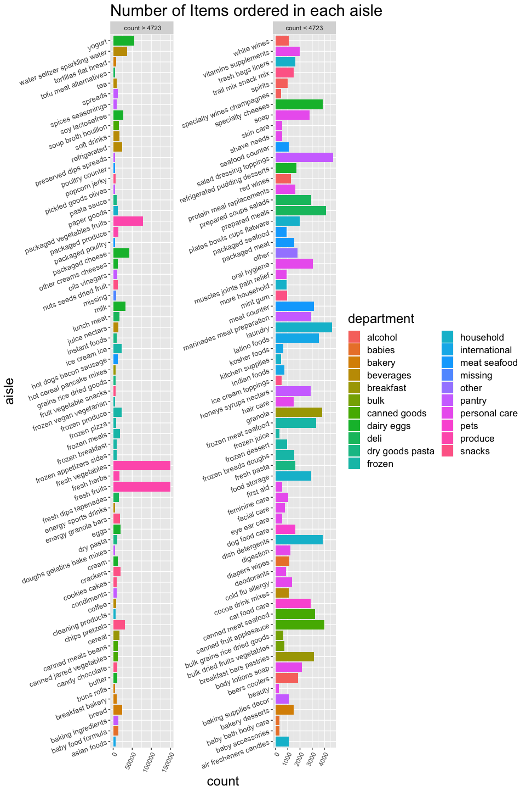

P8105\_hw3\_tt2714
================
Tiffany Tu
10/8/2018

## Problem 1

Cleaned data to focus on the “Overall Health” topic

``` r
overallhealth_brfss_smart2010 = brfss_smart2010 %>% 
  janitor::clean_names() %>%
  subset(., topic == "Overall Health") %>% 
  select(., -class, -topic, -question, -sample_size, -(confidence_limit_low:geo_location)) %>% 
  mutate(response = as.factor(response)) %>% 
  spread(response, data_value)

healthdata2002 = overallhealth_brfss_smart2010 %>% 
  filter(year == 2002) %>% 
  group_by(locationabbr) %>% 
  mutate(freq = n()) %>% 
  filter(freq == 7)
```

In 2002, CT, FL, NC were observed at 7 locations.

``` r
healthdata = overallhealth_brfss_smart2010 %>% 
  count(year, locationabbr)
  
ggplot(data = healthdata, aes(x = year, y = n, colour = locationabbr)) +
    geom_line(aes(group = locationabbr)) + ggtitle("Frequency of State Responses to Overall Health 2002-2010")
```

<!-- -->

``` r
NYdata = overallhealth_brfss_smart2010 %>% 
  filter(year ==  2002 | year == 2006 | year == 2010) %>% 
  group_by(locationabbr) %>% 
  filter(locationabbr == "NY") %>% 
  ungroup() %>% 
  select(year, Excellent) 

NY_mean = c(mean(NYdata$year == 2002), mean(NYdata$year == 2006), mean(NYdata$year == 2010))
NY_sd = c(sd(NYdata$year == 2002), sd(NYdata$year == 2006), sd(NYdata$year == 2010))

NYsummarytable = data.frame(NY_mean, NY_sd) 
row.names(NYsummarytable) = c("2002", "2006", "2010")
kable(NYsummarytable, caption = "Mean and standard deviation of 'Excellent' Responses in NY")
```

|      | NY\_mean |    NY\_sd |
| ---- | -------: | --------: |
| 2002 |     0.25 | 0.4442617 |
| 2006 |     0.30 | 0.4701623 |
| 2010 |     0.45 | 0.5104178 |

Mean and standard deviation of ‘Excellent’ Responses in NY

``` r
annual_average = overallhealth_brfss_smart2010 %>%
  select(-locationdesc) %>% 
  group_by(year, locationabbr) %>% 
  summarise_all(funs(mean)) %>% 
  janitor::clean_names() %>% 
  gather(key = response, value = proportion, -year, -locationabbr) %>% 
  na.omit()

ggplot(data = annual_average, aes(x = year, y = proportion, colour = locationabbr)) + geom_line() + facet_wrap(~ response, ncol = 2) + ggtitle("State-level averages of response to 'Overall Health'")
```

<!-- -->

## Problem 2

The original dataset has 15 columns and 1384617 rows, containing a lot
of repetitive data. We have orders IDs, each with multiple rows on
ordered product IDs, the order in which the product was added to the
cart, user ID, and more columns on product information such as product
aisle and department. We also have data on the hour and the day of the
week the product was added to order, coded 0-6 indicating Monday through
Sunday.

For example, in order ID \#36, we have 8 products ordered under
user\#112108. The order was placed 30 days ago and products are under
the following departments: dairy eggs, beverages, produce, deli.

There are a total of 134 aisles. Most items are ordered from the fresh
vegetables aisle and least ordered from beauty.

``` r
data(instacart)
aisle_count = instacart %>% 
  group_by(aisle, department) %>% 
  summarise(n = n()) %>% 
  mutate(split = ifelse(n > 4723, " count > 4723", "count < 4723")) 

ggplot(aisle_count, aes(x = aisle, y = n, fill = department)) + geom_bar(stat="identity") + labs(title = "Number of Items ordered in each aisle", y = "count") + theme(axis.text.y = element_text(angle = 20, hjust = 1)) + facet_wrap(~ split, scales = "free",  ncol = 2) + theme(axis.text.x = element_text(angle = 65, hjust = 1), axis.text.y = element_text(size = 10), plot.title = element_text(size = 22), legend.text = element_text(size = 13), axis.title.x = element_text(size = 18), axis.title.y = element_text(size = 18), legend.title = element_text(size=18)) + coord_flip()
```

<!-- -->

``` r
popular_items = instacart %>% 
  select(product_name, aisle) %>% 
  filter(aisle == "baking ingredients" | aisle == "dog food care" | aisle == "packaged vegetables fruits") %>% 
  group_by(product_name, aisle) %>% 
  summarise(n = n()) %>% 
  group_by(aisle) %>%  slice(which.max(n)) %>% 
  select(aisle, product_name)

kable(popular_items, caption = "Most Popular Item in Each Aisle")
```

| aisle                      | product\_name                                 |
| :------------------------- | :-------------------------------------------- |
| baking ingredients         | Light Brown Sugar                             |
| dog food care              | Snack Sticks Chicken & Rice Recipe Dog Treats |
| packaged vegetables fruits | Organic Baby Spinach                          |

Most Popular Item in Each Aisle

``` r
order_hour = instacart %>% 
  select(product_name, order_dow, order_hour_of_day) %>% 
  filter(product_name == "Pink Lady Apples" | product_name == "Coffee Ice Cream") %>% 
  group_by(product_name) %>% 
  mutate(id = row_number()) %>% 
  spread(order_dow, order_hour_of_day) %>% 
  select(-id) %>% 
  summarise_all("mean", na.rm = T) 

kable(order_hour, digits = 2, col.names = c("Product Name", "Monday", "Tuesday", "Wednesday", "Thursday", "Friday", "Saturday", "Sunday"), caption = "Mean Hour of Day Orders are Placed")
```

| Product Name     | Monday | Tuesday | Wednesday | Thursday | Friday | Saturday | Sunday |
| :--------------- | -----: | ------: | --------: | -------: | -----: | -------: | -----: |
| Coffee Ice Cream |  13.77 |   14.32 |     15.38 |    15.32 |  15.22 |    12.26 |  13.83 |
| Pink Lady Apples |  13.44 |   11.36 |     11.70 |    14.25 |  11.55 |    12.78 |  11.94 |

Mean Hour of Day Orders are Placed

## Problem 3

The original dataset from NOAA National Climatic Data Center has 7
columns and 2595176 rows, with a lot of missing entries. The column
names are id, date, prcp, snow, snwd, tmax, tmin. The id gives the
weather station ID, and the rest of the columns record snowfall related
observations by date. There are a lot of missing data because each
weather station may not collect data every day, and might not have
collected for all variables.

Here I cleaned the data by converting the date column into 3 columns:
year, month, day. I switched the units for snow (snowfall) and snwd
(snow depth) from mm to inches, prcp (precipitation) from tenths of mm
to mm, and tmax/tmin (temperature) from tenths of Celcius to Celcius.

``` r
data(ny_noaa)

noaa = ny_noaa %>% 
  separate(date, into = c("year", "month", "day"), sep = "-") %>% 
  mutate(snow = snow*0.039, snwd = snwd*0.039, prcp = prcp*0.1, tmax = as.numeric(tmax)*0.1, tmin = as.numeric(tmin)*0.1) 
kable(head(noaa))
```

| id          | year | month | day | prcp | snow | snwd | tmax | tmin |
| :---------- | :--- | :---- | :-- | ---: | ---: | ---: | ---: | ---: |
| US1NYAB0001 | 2007 | 11    | 01  |   NA |   NA |   NA |   NA |   NA |
| US1NYAB0001 | 2007 | 11    | 02  |   NA |   NA |   NA |   NA |   NA |
| US1NYAB0001 | 2007 | 11    | 03  |   NA |   NA |   NA |   NA |   NA |
| US1NYAB0001 | 2007 | 11    | 04  |   NA |   NA |   NA |   NA |   NA |
| US1NYAB0001 | 2007 | 11    | 05  |   NA |   NA |   NA |   NA |   NA |
| US1NYAB0001 | 2007 | 11    | 06  |   NA |   NA |   NA |   NA |   NA |

A few of the most commonly observed values for snowfall in inches:
2.964, 1.989, 0.507, 0.975, 0. These values are close to zero which is
reasonable because the average of overall observed snowfall is 0.194494
and the top five observed months are 05, 08, 07, 12, 10 - there are more
summer months observed than winter months.

``` r
january_july = noaa %>% 
  filter(month == 01 | month == 07)
```
